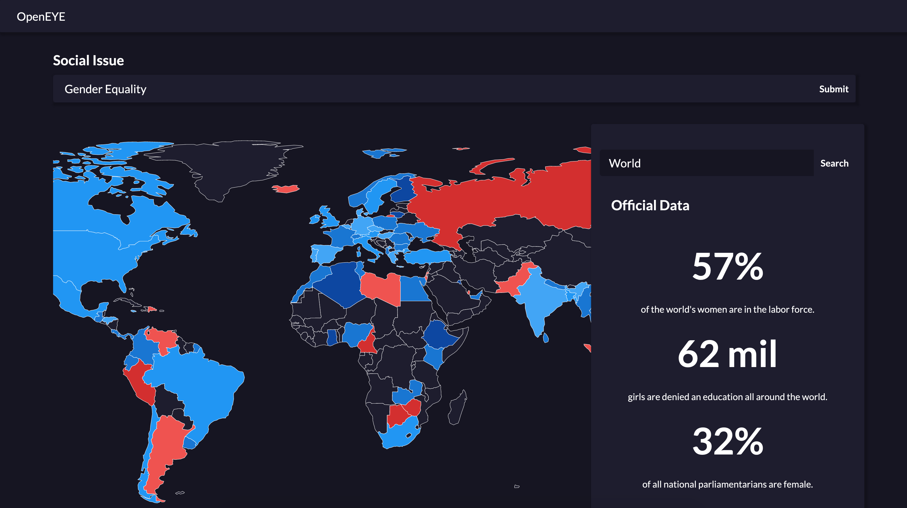

# OpenEYE
<b>Created by Achyudh Ram, Faisal Lalani, Lia Bozarth, Reshu Bisht, and Yada Pruksachatkun </b>

> OpenEYE's goal is to to target misinformation on social issues by representing the dichotomy between perceptions and actual data. 

Users are prompted to select a social issue. On the left is a compiled map of countries around the world, each presenting a color based on the average sentiment of tweets compiled from that country. On the right is data from different official sources (World Bank, United Nations) that attempt to shed light on the true nature of the selected social issue.

